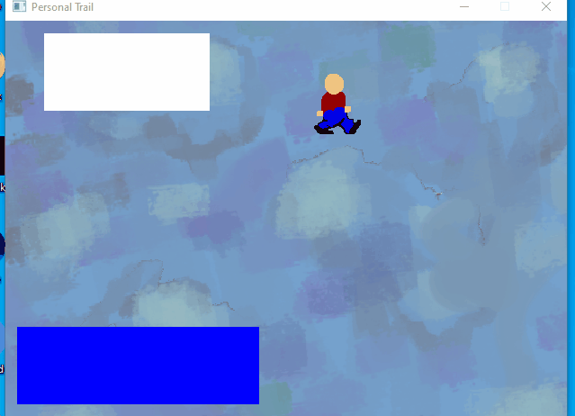

# personal-trail

### About

My personal game made with the Win32 API.

### How to compile

Just run `build.bat` and drag the files in the `assets` folder to the `bin/assets` folder.

### Contributing

Feel free to fork it, but I probably will not accept PRs. 

### License

The project is licensed under the MIT license. See `LICENSE`.
